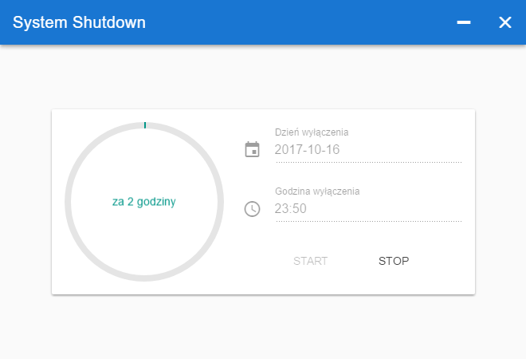

# system-shutdown

> Simple system shutdown on timer



## Build 
``` bash
# install dependencies
yarn

# serve with hot reload at localhost:9080
yarn dev

# build electron application for production
yarn build

# lint all JS/Vue component files in `src/`
npm run lint
```